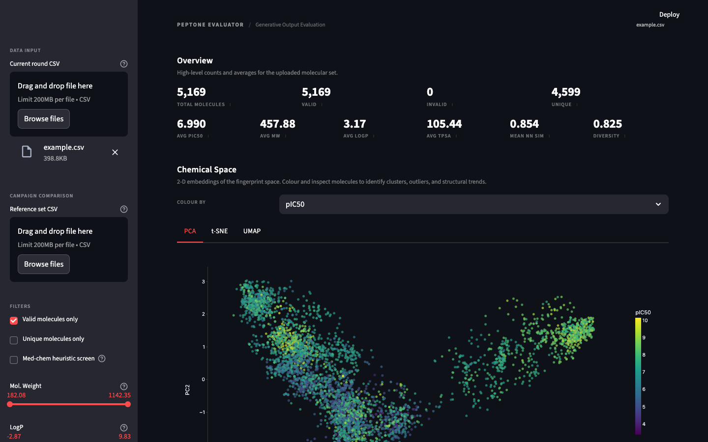

# Peptone Generative Output Evaluator v2

[](https://github.com/salsazhar/peptone-evaluator-v2/actions/workflows/tests.yml)
[](https://peptone-evaluator-v2.streamlit.app/)

A modular Streamlit dashboard for evaluating generative molecular outputs via chemical-space analysis, descriptor computation, scaffold analysis, and rule-based filtering.

Built for evaluating small-molecule design rounds — not a generic cheminformatics dashboard.

**[Try the live demo](https://peptone-evaluator-v2.streamlit.app/)** — upload the [sample dataset](data/example.csv) (5,168 molecules with SMILES + pIC50) to see every feature in action.



## Quick Start

### Live demo (no install required)

1. Open **[peptone-evaluator-v2.streamlit.app](https://peptone-evaluator-v2.streamlit.app/)**
2. Download the [example dataset](data/example.csv) from this repo
3. Upload it via the sidebar

### Run locally

```bash
git clone https://github.com/salsazhar/peptone-evaluator-v2.git
cd peptone-evaluator-v2
pip install -r requirements.txt
streamlit run app.py
```

Any CSV with a **SMILES** column will work. A **pIC50** column is optional — if present, scatter plots are coloured by binding affinity.

## Features

### Core Evaluation
- **Descriptor computation** — MolWt, LogP, TPSA, HBD, HBA, Rotatable Bonds, Ring Count, Fraction Csp3, Heavy Atom Count, Formal Charge, QED, Molecular Formula
- **Descriptor inspector** — single-descriptor histogram with KDE overlay, annotated mean/median/IQR, summary statistics table
- **Rule-based flags** — Lipinski-like filter, high flexibility, high lipophilicity, extreme size
- **Priority shortlist** — composite scoring (pIC50 + QED + diversity + rule compliance) with diverse representative selection

### Chemical Space
- **Dimensionality reduction** — PCA, t-SNE, and UMAP on 1024-bit Morgan fingerprints (ECFP4)
- **Campaign comparison** — overlay current vs. reference set with novelty/overlap metrics
- **Similarity & diversity** — pairwise Tanimoto, nearest-neighbour similarity, diversity score, top similar pairs, most isolated molecules

### Scaffold Analysis
- **Murcko decomposition** — extract core scaffolds from all valid molecules
- **Generic frameworks** — collapse to carbon-only skeletons for aggressive grouping
- **Scaffold diversity metrics** — unique scaffold count, scaffold ratio, singleton fraction, top scaffold frequency
- **Frequency bar chart** — visual distribution of the most common scaffolds

### Substructure Search
- **SMARTS/SMILES query** — find molecules containing a specific pharmacophore or functional group
- **Preset patterns** — common substructures (benzene, amide, sulfonamide, pyridine, piperazine, etc.)
- **Structure highlighting** — SVG rendering with matched atoms highlighted
- **Match export** — download matching molecules as CSV

### Export
- **CSV download** — full processed data with all computed columns
- **SDF download** — Structure-Data File with embedded properties, ready for PyMOL, MOE, Maestro, and other chemistry tools
- **Shortlist CSV** — priority-ranked molecules
- **Diverse representatives CSV** — structurally diverse subset

### Interactive Controls
- Sidebar sliders for all descriptors
- Toggle for valid/unique/drug-like molecules
- Colour-by selector for chemical space plots
- Configurable t-SNE perplexity and UMAP parameters

## Project Structure

```
peptone_evaluator_v2/
├── app.py                          # Streamlit entrypoint
├── requirements.txt
├── README.md
├── data/
│   └── example.csv                 # 5,168 molecules (SMILES + pIC50)
├── tests/
│   ├── conftest.py                 # Shared fixtures (valid/invalid/duplicate molecules)
│   ├── test_chemistry.py           # SMILES parsing and uniqueness
│   ├── test_data_loader.py         # CSV loading and column normalisation
│   ├── test_descriptors.py         # Descriptor computation and rule flags
│   ├── test_export.py              # SDF export
│   ├── test_filters.py             # Filter pipeline
│   ├── test_fingerprints.py        # Morgan fingerprint generation
│   ├── test_prioritization.py      # Priority scoring and diverse selection
│   ├── test_scaffolds.py           # Murcko decomposition and diversity
│   ├── test_similarity.py          # Tanimoto similarity and duplicate detection
│   └── test_substructure.py        # Substructure search and presets
└── src/
    ├── config.py                   # Constants and thresholds
    ├── data_loader.py              # CSV loading and column normalisation
    ├── chemistry.py                # SMILES parsing and canonicalisation
    ├── descriptors.py              # Molecular descriptors, rule flags, summary stats
    ├── fingerprints.py             # Morgan fingerprint generation
    ├── scaffolds.py                # Murcko decomposition and scaffold diversity
    ├── substructure.py             # SMARTS/SMILES substructure search and highlighting
    ├── dimensionality_reduction.py # PCA / t-SNE / UMAP
    ├── similarity.py               # Tanimoto similarity and diversity metrics
    ├── prioritization.py           # Composite scoring and shortlisting
    ├── campaign.py                 # Reference set comparison
    ├── filters.py                  # DataFrame filtering logic
    ├── export.py                   # SDF and CSV export utilities
    ├── plotting.py                 # Plotly figure builders
    ├── theme.py                    # Theme-aware CSS and styling
    └── ui.py                       # Streamlit UI components
```

## Module Responsibilities

| Module | Purpose |
|---|---|
| `config.py` | All constants, thresholds, column names, and defaults in one place |
| `data_loader.py` | CSV ingestion, case-insensitive column detection, pIC50 coercion |
| `chemistry.py` | SMILES → RDKit Mol → canonical SMILES, validity tracking |
| `descriptors.py` | 12 molecular descriptors + 4 rule flags + summary statistics |
| `fingerprints.py` | 1024-bit Morgan fingerprints (radius 2, ECFP4-equivalent) |
| `scaffolds.py` | Murcko scaffold extraction, generic frameworks, frequency analysis |
| `substructure.py` | SMARTS/SMILES parsing, substructure matching, SVG highlighting |
| `dimensionality_reduction.py` | PCA, t-SNE, UMAP wrappers with consistent interface |
| `similarity.py` | Pairwise Tanimoto, nearest-neighbour, diversity score, duplicate detection |
| `prioritization.py` | Composite scoring, shortlist generation, greedy diverse selection |
| `campaign.py` | Reference set overlap detection, descriptor comparison tables |
| `filters.py` | Pure-function DataFrame filtering from a `FilterSpec` dataclass |
| `export.py` | DataFrame → SDF conversion with embedded properties |
| `plotting.py` | All Plotly figures: scatter, histogram, KDE inspector, scaffold bars |
| `theme.py` | Theme-aware CSS injection, Plotly template/layout helpers |
| `ui.py` | Streamlit components: header, metrics strips, sidebar controls, shortlist |

## Tests

87 tests across 10 modules. Run with:

```bash
python -m pytest tests/ -v
```

The test suite validates the computational core of the evaluator — the modules that parse molecules, compute properties, and produce scores. These are the functions where correctness matters most: a wrong Tanimoto score, a miscomputed descriptor, or a broken filter silently produces misleading results in the dashboard. The tests catch regressions in this layer so the UI can be iterated on with confidence.

| Module | Tests | What it validates |
|---|---|---|
| `test_chemistry` | 10 | SMILES parsing, canonicalisation, validity flags, duplicate detection |
| `test_data_loader` | 5 | Case-insensitive column detection, pIC50 coercion, missing-column errors |
| `test_descriptors` | 10 | All 12 descriptors computed, rule flags (Lipinski, extreme size), summary stats |
| `test_fingerprints` | 5 | Output shape, binary values, identical-molecule invariance, invalid-input handling |
| `test_filters` | 8 | Valid/unique/Lipinski toggles, range sliders, immutability of input, empty results |
| `test_similarity` | 11 | Pairwise Tanimoto, nearest-neighbour, diversity score, duplicates, edge cases |
| `test_scaffolds` | 10 | Murcko decomposition, generic frameworks, frequency tables, diversity metrics |
| `test_substructure` | 7 | SMARTS/SMILES parsing, substructure matching, all 14 preset patterns validated |
| `test_prioritization` | 6 | Composite scoring, shortlist ordering, diverse selection, no-pIC50 mode |
| `test_export` | 4 | SDF generation, property embedding, invalid-molecule handling |

Fixtures in `conftest.py` provide a small, deterministic molecule set (ethanol, benzene, aspirin, ibuprofen, testosterone + invalid SMILES + duplicates) that exercises the main code paths without depending on external data.

## Design Decisions

- **Single cached enrichment pass** — RDKit Mol objects are created, used for descriptors, scaffolds, and fingerprints, then discarded before Streamlit's cache serialises the result.
- **Filters apply to display, not computation** — dimensionality reduction runs on all valid molecules; filters only control which points are shown, preventing coordinate shifts on filter change.
- **Similarity sampling** — pairwise Tanimoto is computed on up to 5,000 molecules; larger datasets are randomly sampled and flagged in the UI.
- **Optional pIC50** — the app works fully without a pIC50 column; colour-by-activity features are conditional.
- **SDF with properties** — exported SDF files include all computed descriptors, scaffold assignments, and scores as data fields.
- **Substructure presets** — common pharmacophoric patterns are pre-loaded for quick access; custom SMARTS also supported.
- **Scaffold diversity as a metric** — scaffold ratio and singleton fraction quantify whether a generative model is exploring diverse core structures.

## Future Extensions

- Round-over-round improvement tracking (property profile drift across campaigns)
- Property-space coverage maps for IDP-relevant chemical space
- Conformational flexibility scoring (relevant for disordered protein targets)
- Batch substructure filtering across multiple patterns
- Scaffold-aware clustering in chemical space plots
